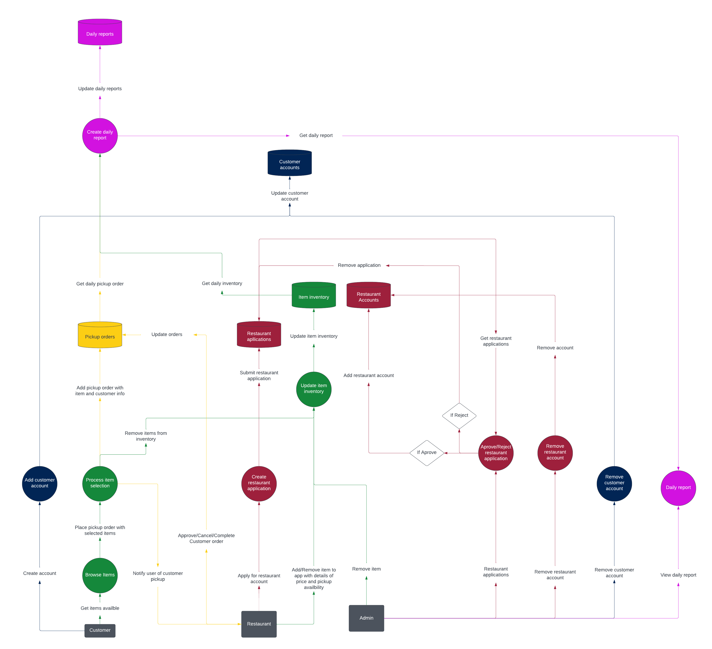

<!--

This markdown document is designed for rendering via pandoc script provided (render-srs.sh)

It is NOT compatible with Github-flavoured markdown.

-->

\newpage

# Table of Contents

- [Table of Contents](#table-of-contents)
- [Equifood](#equifood)
  - [Context](#context)
  - [Description](#description)
  - [Users](#users)
    - [Customer](#customer)
    - [Merchant](#merchant)
    - [Admin](#admin)
  - [Data flow diagrams](#data-flow-diagrams)
    - [Lengend](#lengend)
    - [DFD level 0](#dfd-level-0)
    - [DFD level 1](#dfd-level-1)
  - [Functional Requirements](#functional-requirements)
- [Handoff guide](#handoff-guide)
  - [Overview](#overview)
    - [Frontend](#frontend)
      - [Customer App](#customer-app)
      - [Merchant App](#merchant-app)
    - [Backend](#backend)
    - [Shared](#shared)
  - [Usage](#usage)
    - [Installation \& Configuration](#installation--configuration)
    - [Development](#development)
    - [Testing](#testing)
  - [Documention](#documention)
  - [Further Work](#further-work)
    - [UI Work](#ui-work)
    - [Database Work](#database-work)
    - [File System Work](#file-system-work)
    - [Testing](#testing-1)
  - [Required maintenence/upkeep](#required-maintenenceupkeep)
- [Relevant Resources](#relevant-resources)

\newpage

# Equifood

## Context
Project Equifood tries to reduce food wastage and promotes sustainable food systems in Kelowna. The designed app helps to reduce food wastage by donating leftovers from restaurants.

## Description
Equifood is mobile app that connects restaurants with individuals in order to allow the individuals to obtain the restaurants' food leftovers for free or at a significantly reduced price.

The app also streamlines Equifood's donations tracking process, as it automatically keeps track of the amount of money worth of food that Equifood has contributed to donating via its restaurant partners.

## Users
Equifood has 3 diffrent user groups.
  - Customers
  - Merchants
  - Admin

### Customer
The Customer user group is comprised of people who would like to help reduce overall food waste by taking home restaurant leftovers at a discounted price.

Customers are able to
  - Create accounts
  - Browse availble merchants and their items
  - Add items to their order
  - Place orders
  - Cancel orders

Examples:
  - University students that are food insecure.
  - Low-income households, who often use discounted offers.
  - General public who want to save money.
### Merchant
The Merchant user group is comprised of restaurants who want to help reduce overall food waste by selling their leftover food at a discounted price.

Merchants are able to
  - Add items to their available menu
  - Accept incoming orders
  - Cancel orders
  - Mark orders as completed
  - Edit their restaurant information

Examples:
  - Restaurants where pre-prepared dishes often thrown out.
  - University food vendors where lots of food goes to waste.

### Admin
The Admin are members of the equifood team who manage what restaurants will be allowed to have an account on the app.

Admin are able to
  - Add merchants via admin portal
  - View all database records manually
  - Modify arbitary database records

## Data flow diagrams
Below are our two data flow diagrams. These diagrams show a high level representation of how the app works.

### Lengend
Our data flow diagrams are color coded to better show what kind of information is being interacted with.
 

### DFD level 0
This is our level 0 data flow diagram and as you can see this is the highest level representation of how our app works.

### DFD level 1
This is our level 1 data flow diagram witch is a much more detailed representation of how our works.

## Functional Requirements
There are several things important to include in an app like Equifood that we have implemented. 

Equifood was designed so that everything is easily accessible and is within the fewest amount of clicks possible. With an overal easier app to use, Customers and Merchants are much more likely to consistently use the app.

There are a couple things that are necessary for each user group witch we have implemented.

Customers must be able to
  - Create accounts
  - Browse availble merchants and their items
  - Add items to their order
  - Place orders
  - Cancel orders

Merchants must be able to
  - Add items to their available menu
  - Accept incoming orders
  - Cancel orders
  - Mark orders as completed
  - Edit their restaurant information

Admin admin must be able to
  - Add merchants via admin portal
  - View all database records manually
  - Modify arbitary database records

# Handoff guide

## Overview

It is important to understand that the Equifood App is comprised of multiple sub-projects which are all distributed as a part of the monorepo. This is an [NX](https://nx.dev/) monorepo and all syntax for interfacing with these projects (i.e. running particular actions) will be according to the NX standards.

The three applications that exist are currently **Equifood Customer**, **Equifood Merchant**, and **Equifood API**.

Additionally, some shared libraries exist for code-sharing between these apps.

All code is strongly-typed and written in [TypeScript](https://www.typescriptlang.org/) for the benefits of static analysis and error prevention, as well as a more convenient developer experience.

### Frontend

There are two frontend apps for this project.

1. The customer facing app
2. The merchant/restaurant facing app

**NOTE** The frontend requires an `.env` file to be created (use `example.env` as reference)

#### Customer App

The client-facing frontend for the project (React Native) can be found in the `apps/customer-app` directory.

The app is supported as an IOS/Android application.

**NOTE** The Equifood Customer App requires an `.env` file to be created (use `example.env` as reference)

#### Merchant App

The merchant-facing frontend for the project (React Native) can be found in the `apps/merchant-app` directory.

The app is supported as an IOS/Android application.

**NOTE** The Equifood Merchant App requires an `.env` file to be created (use `example.env` as reference)

### Backend

The backend for the project (NestJS) can be found in the `apps/equifood-api` directory.

Within the backend/API an admin portal endpoint is exposed for the administartor users (`/admin`). For instance, if your API is running on http://localhost:3333, then your admin portal would exist at http://localhost/admin.

**NOTE** The backend requires an `.env` file to be created (use `example.env` as reference)

### Shared

Shared types for the frontend and backend can be found in the `lib/api-interfaces` directory.

These types are shared between all of the TypeScript apps within this project for easy code reuse,

Additionally, UI components, auth flows, and various other hooks/providers are shared in the `lib/ui-shared` directory. These are shared between the two React Native apps (Equifood Customer & Equifood Merchant).

## Usage

### Installation & Configuration

1. Install [Node JS](https://nodejs.org/en/) v16. This task can optionally be completed using [Node Version Manager](https://github.com/nvm-sh/nvm).
2. Ensure you have C/C++ build tools installed on machine (i.e. gcc). Bettersqlite uses node-gyp and is dependent on these. [Visual C++ Redistributable](https://learn.microsoft.com/en-us/cpp/windows/latest-supported-vc-redist?view=msvc-170) may be required for users on Windows. If you encounter issues with compiled binaries, please consider running the `npm run rebuild` command.
3. Run `npm install`
4. Create a configuration file `.env` in the `apps/equifood-api`, `apps/equifood-customer`, and `apps/equifood-merchant` directory (use `example.env` for reference)

### Development

Apps can be served using `nx serve APP_NAME` command. Currently available apps are `equifood-api`, `equifood-customer`, and `equifood-merchant`.

Remember, for either the customer or merchant application to functional, the backend must be running and properly configured in the respective `.env` file.

Currently, there are 3 apps that can be launched:

1. Equifood Customer: `npx nx run equifood-customer`
2. Equifood Merchant: `npx nx run equifood-merchant`
3. Equifood API: `npx nx run equifood-api`

### Testing

1. Run `npx nx test PROJECT_NAME` in order to run all tests for the desired project. If more information is needed, please refer to the [NX documentation](https://nx.dev/).

It is noted that unit tests are somewhat minimal in the project as it would have been difficult to write a thoroughly tested application in the very limited time provided. Some features (algorithmically complex) are tested, whereas large parts of the frontend are not. Ultimately, mocking numerous API requests and updating these as the app evolved would have been very tiresome and detracted from development.

It would be beneficial to test backend features, not only using unit tests, but also using manual testing techniques. There are some aspects concerning security which should be very closely monitored (i.e. behaviour with regards to uploads, just about anything in the `AuthModule` and especially all social logins, etc.).

While we have tested for many edge cases in terms of the behaviour of the app, it would be important to conduct an independent QA deep dive in order to ensure that the app performs as expected.

## Documention

Relevant documentation for this project exists in the `documentation` folder

Within this folder all technical specifications for the software, IP agreements, configuration instructions, and any other pertinent information can be found.

These are mostly written in markdown, however some exists in the form of PDF files.

## Testing Report

The final round of testing before handoff consisted of eight testing sessions by eight different testers. These testers raised a number of issues and improvements for the app. Some of these issues have been handled, but others are issues worth considering. Many of these are listed under the [issues](https://github.com/jribbink/equifood/issues) page on the GitHub page, but some are not listed. More general issues can be found [below](#further-work).

**Note: The issues presented in this report are NOT comprehensive. The app may have undocumented issues not listed here. We highly recommend testing further as described in the [Testing section above](#testing).** It is also worth noting that some issues may arise due to the testing environment; issues regarding the map in particular were strongly suspected of being tied to Android Studio's emulation settings, for which we couldn't find a fix.

In our testing, users were first asked to take the role of an EquiFood customer, looking to order food through the app from a particular restaurant. Second, they were asked to take the role of a merchant with an EquiFood account, who wanted to manage their restauranta's orders and their menu.

Notable issues discovered include, but are not limited to:

### High-Priority Issues

1. The map loads inconsistently -- speed varies, if it loads at all -- and sometimes gives an UnhandledPromiseRejection. Unclear if this is an Android Studio issue.
2. "Back" buttons for user navigation do not appear on all screens. This violates good design principles. (Back buttons have been implemented on some screens and may be copied.)
3. If a user fails to log in, no error message is displayed in their view. Should differentiate between invalid credentials and a failed connection to the server.
4. Similarly, if a user attempts to create an account but encounters an issue (e.g. their password is invalid), there is no error message.
5. Image upload was attempted but not implemented confidently. May be a mix of faulty implementation and Android Studio issues.
6. Order deadline time currently defaults to 15 minutes from the time the order is placed. This should be changed to a specification by the merchant.
7. Orders on the merchant side do not currently have an identifier of who placed the order. This makes it impossible for the merchant to know who the order is for.

### Medium-Priority Issues

1. All EquiFood signposting and branding is currently extremely basic, and should be replaced with an official logo and branding when able.
2. Merchants on the main page (and food items on individual merchants' pages) are not paginated or limited to a certain number at first. This may cause issues with load times or visual overload for users.
3. The order deadline time should be shown on the OrderList page as well as on an individual order's page.

### Low-Priority Issues

1. Some parts of the merchant app are unnecessary due to being copied from the customer app. Example: the merchant does not need thanks on an individual order's page, nor a map pointing to their own location.
2. Hyphenated phone numbers should be accepted (e.g. 111-111-1111) rather than only strings of ten digits; or, at least, it should be automatically formatted into a phone number format for ease of viewing.
3. Some relevant (but arguably superfluous) information is missing; our testers identified an instruction to "ask for an EquiFood order for \[name\]" on the order page to be helpful, though this may not be necessary.

Testers identified the app's greatest strengths as its aesthetic, the visibility of the system, its internal consistency, and how familiar the setup is compared to other food delivery apps. The greatest pitfall of the app is the lack of documentation and assistance with errors, which admittedly was a lower priority with our limited development time.

## Further Work

While this is a reasonably functional app, there exists some components which might make it a poor candidate for the App Store or Google Play in the current state (or just features that still need further implementation).

Any future work that we have foreseen or ran out of time to get to exists as an [issue in our GitHub repository](https://github.com/jribbink/equifood/issues). While most of the further work can be found here, we thought it could be helpful to shed more detail on a few special considerations.

### UI Work

Some of the UI has not been polished (i.e. `ItemListScreen` on Merchant App, `MerchantScreen` on Customer App, other aspects which can quickly be sighted in a quick review).

### Database Work

The API has been generally developed with `better-sqlite3` in mind. While the database type can in fact be configured in the `.env`, it would be prudent to ensure the code complies with a modern, scalable database such as `MariaDB`. Some data types may not be supported on such databases, or data types that are encoded as VARCHAR/TEXT in `better-sqlite3` may have beter alternatives in other databases. `better-sqlite3` was deployed for the relative ease of use within a NodeJS environment for quick development, but better alternatives exist.

### File System Work

The file system undoubtedly needs a bit of an overhaul. While a large part of the infrastructure exists for placing uploads inside of something like an S3 bucket or other cloud provider, it is currently only configured for local storage. A small amount of work would need to be done in order to ensure that these files are outsourced somewhere accessible somewhere with adequate redundancy, space, and the ability to access without bottlenecking the API.

### Testing

First and foremost, it would be important to stress test this app using a sufficient number of users in order to ensure it scales well. Beyond this, the test coverage of this application could probably improve (especially with regards to the more complex backend situations). This was also mentioned in a [segment above](#testing). There are a few security considerations that also need to be tested/implemented if this app was going to be deployed to the market. Any of the considerations we have had exist in our GitHub repository.

## Required maintenence/upkeep

None! We have no third-party subscriptions or logins. Everything is hosted locally as of now and this can be deployed to a third party server/provider as needed for your use case.

Note: You will need to generate [Google Sign-In](https://developers.google.com/identity/sign-in/web/sign-in) and [Facebook Sign-In](https://developers.facebook.com/docs/development/create-an-app/) tokens for the social logins. These will need to be configured in the `.env` file of the Equifood Customer App.

\newpage

# Relevant Resources

Link to GitHub repository: https://github.com/jribbink/equifood

Link to Promo Video: https://github.com/jribbink/equifood/blob/master/docs/promo-video.mp4
