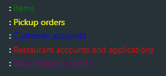
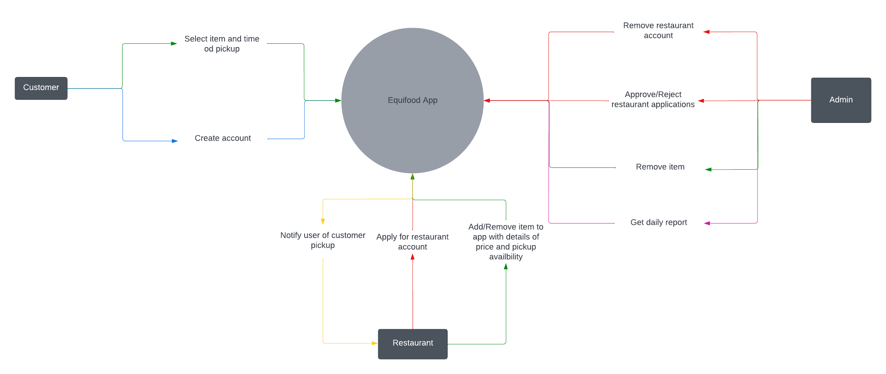
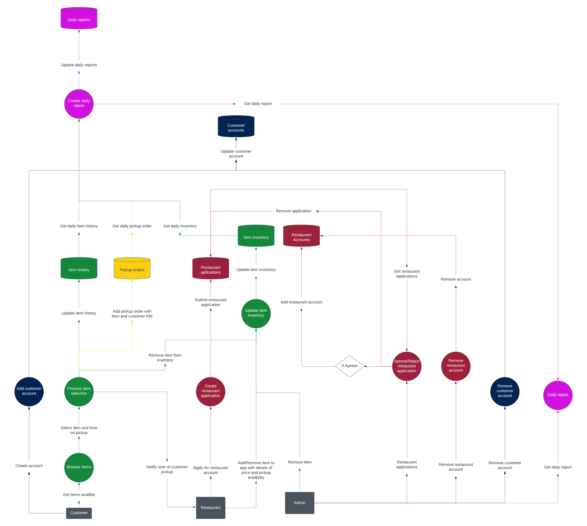

# Table of Contents

- [Table of Contents](#table-of-contents)
- [Software Description](#software-description)
- [Schedule](#schedule)
- [Frameworks, libraries, and database ("Tech Stack")](#frameworks-libraries-and-database-tech-stack)
  - [Client App](#client-app)
  - [Backend](#backend)
  - [Database](#database)
- [Testing plan](#testing-plan)
  - [Static analysis](#static-analysis)
  - [Regression Testing](#regression-testing)
  - [Unit testing](#unit-testing)
  - [End-to-end testing](#end-to-end-testing)
- [User Groups](#user-groups)
- [Non-Functional requirements and environmental constraints](#non-functional-requirements-and-environmental-constraints)
- [Data Flow Diagrams](#data-flow-diagrams)
    - [Data Flow Diagram Level 0](#data-flow-diagram-level-0)
    - [Data Flow Diagram Level 1](#data-flow-diagram-level-1)

# Software Description

The EquiFood software is meant as a way to connect consumers with food distribution businesses to reduce food waste by selling food at a discounted price that would otherwise go to waste. It's not designed to sell the products on its own, but only to allow this connection. The app functions by allowing businesses to post listings of food that they want to sell at a discounted price, which should have a list of tags that can be added to allow for easy searching later. These listings should have a geolocation attached; each restaurant would have a default geolocation, but it should be editable if necessary. The consumers are then able to log into the app and search for food they're interested in -- either by browsing food that is nearest to them, or by searching for food by name or by tag.

A potential option is for the customers to "reserve" the food, and have it removed from the listing so that they can be sure to pick it up. If this direction is taken, the app would notify the restaurant about the reservation, and require a specific timeline from the customer for when they will be able to pick the food up. If the customer does not follow through in that time, the reservation should be removed.

# Schedule

    Term 1
        Week 7: Requirements report + project requirement presentation.
        Week 8: Finish paper prototype and start on the app.
        Week 9: Get the base code working to have phone compatible AR size to show.
        Week 10: Create customer account database and functions.
        Week 11: Create restaurant merchant account database and functions.
        Week 12: Finish up little touches building home screen.
        Week 13: Peer testing report I + video demo (Bug Testing).

        This is the bare minimum requirement. homescreen working at the minimum.

    Term 2
        Week 1: Implement Add / Remove items database.
        Week 2: implement Item history and Item inventory.
        Week 3: Start on Google Maps API to link with restaurants.
        Week 4: Link the description page with google maps.
        Week 5: Make the restaurants list in proximity order.
        Week 6: Make order confirmation page.
        Week 7: Remove listing upon order confirmation .
        Week 8: Bug testing / Finishing up touches for peer testing.
        Week 9: Peer testing report II + video demo II (Bug Testing).
        Week 10: Create settings page .
        Week 11: Create account page, get dummy account working.
        Week 12: Admin tools, Daily reports.
        Week 13: Bug testing / Extra features.
        Week 14: Final Report + Final Presentation.

# Frameworks, libraries, and database ("Tech Stack")

The EquiFood software necessitates both a frontend, client-facing interface (in the form of a mobile app) and a backend API responsible for software business logic. Additionally, this backend API must be paired with some form of relational database.

## Client App

|                       | Pros                                                                                                                                                                                                                                                                                                                          | Cons                                                                                                                                                      |
| --------------------- | ----------------------------------------------------------------------------------------------------------------------------------------------------------------------------------------------------------------------------------------------------------------------------------------------------------------------------- | --------------------------------------------------------------------------------------------------------------------------------------------------------- |
| **React Native**      | - Very familiar language (JavaScript), very mature language - Up to 70% of code can be shared across platforms - Can share typings with a Node.js/JS backend - Business logic can be shared with JS backend - Widespread adoption (~15% of top 500 US apps use RN & used by Instagram, Facebook, Walmart) | - Larger bundle size - Slightly lower performance than the latter two options - Bottlenecked performance between worker and UI thread           |
| Native (Swift/Kotlin) | - Superior performance - Smaller bundle size                                                                                                                                                                                                                                                                             | - Not cross platform - Requires knowledge of multiple less-familiar programming languages - Greater learning curve than JavaScript/React Native |
| Flutter               | - Cross-platform - SDK with prebuilt widgets and components - Robust community support                                                                                                                                                                                                                              | - Large bundle size - Uses unfamiliar and immature programming language (Dart) - Limited ecosystem compared to JavaScript                       |

For the reasons listed above, it seems clear that React Native is the superior option. Development times will be markedly faster than those of a native solution (Swift/Kotlin) and the learning curve will be far easier than that of Flutter/Dart. JavaScript is a very familiar language with a history of several decades and React.js is extremely familiar to any frontend developer.

Additionally, the pairing of JavaScript/TypeScript on both the frontend and backend systems will allow sharing of business logic/types as well as liberate the developers of learning multiple esoteric programming languages.

**React Native** is the clear winner.

## Backend

|            | Pros                                                                                                                                                                                                                                                                                                                                                         | Cons                                                                                                                                                                                        |
| ---------- | ------------------------------------------------------------------------------------------------------------------------------------------------------------------------------------------------------------------------------------------------------------------------------------------------------------------------------------------------------------ | ------------------------------------------------------------------------------------------------------------------------------------------------------------------------------------------- |
| **NestJS** | - Very opinionated (clear design patterns, structure) - Uses MVC architecture - Built-in features (users, auth, more) - Single language for frontend/backend (JS) - Seamless database integration - Angular-like dependency injection - High performance - Medium learning curve - TypeScript - Highly scalable | - Can potentially be too opinionated - Relatively new/not very mature - Lots of obfuscation (not obvious what certain decorators do)                                              |
| EspressJS  | - Easy learning curve - High performance - Single language for frontend/backend (JS)                                                                                                                                                                                                                                                               | - Not suitable for large projects - Poor out-of-box security - Limited out-of-box features - No clear design patterns/too open ended and difficult to structure project well |
| Django     | - Uses MVC architecture - Many built-in features (users, auth, etc.) - Built-in security features (i.e. XSS) - Highly scalable                                                                                                                                                                                                                | - Not suitable for small projects - Monolithic framework - No conventions - Steep learning curve - Different language than frontend                                     |

From the options listed Django and NestJS are likely the strongest contenders. A fully-fledged framework with built in autherntication and REST API support is required for this project. EspressJS would be far to flexibile for a project such as this and would likely lead to a bloated and hard-to-follow project strucure (meaning that if NodeJS was the desired platform, NestJS would be superior).

However, **NestJS** is chosen due to its better support for small to mid sized projects as well as lower level of granulaity. This is ideal for the timeframe presented as minimizing development times is of high priority. Furthermore, while Python is very familiar, using TypeScript for both the frontend and backend is ideal and will further work to reduce development times as well as allow all developers to easily work full-stack.

## Database

A relational database is required for this project. Becasue the data is very structured (users, orders, businesses, etc.) and requires many relationships, a relational database is the superior option (compared to NoSQL).

For the scope of this project, there is a general indifference regarding which relational database Equifood uses (dataset and number of concurrent queries will be very small).

Due to this reason, the **MariaDB** will be the database of choice. It is very easy to configure and couples well with NestJS/TypeORM.

# Testing plan

The testing plan is a large concern of the Equifood software as it insures that developers do not create bugs (or regressions) as they augment features within the software.

Another benefit is that a good suite of tests will make the functionality of the software very obvious and benefit the onboarding of new developers.

Finally, automated testing pipelines will prevent the Equifood developers from having to complete manual QA tasks (or at least reduce the scope of them).

## Static analysis

The first line of defence against poor code/bugs in the Equifood codebase against will be **static anaylsis**.

- **ESLint** will be deployed in both the frontend & backend of the equifood software. This will prevent common bugs and enforce code design rules. ESLint is well supported and has many plugins (such as those for React Native/React) so it will pair well in our project.
- **Prettier** will be used to improv the quality of the code. While this isn't necessarily a static analysis tool, prettier will help to enforce styling consistent conventions in the codebase as well as make the code more readable => easier for other devs to understand & less prone to bugs.
- **TypeScript** will be used universally to enforce strong types throughout the Equifood software. This is superior to vanilla JS, as it prevents the creation of type related bugs, unintended `null`/`undefined` values, is more readable (=> less bugs), and has better OOP support than JS.

## Regression Testing

The Equifood software will utilize **retest-all regression testing**.

This means that the software will run the entire test suite again any time that changes are made to the codebase. In practice, this means there will exist a **GitHub Actions** workflow which runs on `pull_request` to `master` and `push` to `master`. This workflow will run the build scripts (i.e. `npm run build`) and the whole test suite (i.e. `npm run test`).

Our automated testing CI/CD pipeline will contain both [unit tests](#unit-testing) and [E2E tests](#end-to-end-testing).

## Unit testing

The choice of unit testing framework for the Equifood software is [Jest](https://jestjs.io/) - which is the most widely supported and used testing framework in Javascript.

Using these Unit tests, the Equifood software will test the logic of small, individual components within the software (classes, funcitons, etc.)

These tests will be writen for both the [frontend](#client-app) and the [backend](#backend).

## End-to-end testing

For E2E tests we will use [Detox](https://github.com/wix/Detox). This choice is justified by the fact that it is built specifically for React Native and is very popular within the community.

E2E tests will run the application as if it would be used by a user and simulate user interactions. These tests will test the whole system (frontend, backend, database).

While E2E tests are very effective at spotting bugs, they are very expensive to develop and not as scalable as unit tests. Additionally these E2E tests will be prone to "flakiness" and unreliability.

For these reasons, only core functionalities will deserve E2E tests (i.e. authentication, happy path of making order, etc.) but niche functions will not receive these tests.

# User Groups

There are three main user groups that can be identified:

1. **Administrators**

   Programmers, administration and similar users who need global access to the app and all functions therein.

2. **Businesses**

   Restaurants and other food distribution businesses. This includes groups such as grocery stores, and notably, university food businesses, who may want a centralized way of advertising themselves to students and distributing food that would otherwise go to waste. In short, they should be able to log into the app through the business view to add, edit and remove the products they have available.

3. **The public**

   Low-income families, university students, and anyone else who is looking to help reduce food waste or find savings on food. They should be able to open the app through the user view, and search for specific products or browse the products available near them, so that they can place a reservation on the product.

# Non-Functional requirements and environmental constraints

    - There might not be any restaurants that support our app around certain users.
    - App will only support English major speaking countries with no localization to reduce development time.
    - The app does not support deliveries which might limit some users’ experiences.
    - User interface must be mobile friendly and support native mobile gestures.
    - Software must be cross-platform and supported on both IOS and Android devices.
    - Inventories must be reliable and up-to-date to prevent invalid orders.

# Data Flow Diagrams

Below are the level 0 and level 1 Data Flow Diagrams for this project. The color of each arrows, proccess, and database depends on the type of information it is dealing with. For example any process that involves the daily report is in pink.

## Legend

# Data Flow Diagram Level 0

 
 
 
 
 

# Data Flow Diagram Level 1
